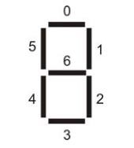

## 基于LCD1602液晶模块的多功能数字时钟

### 前言

> 该程序源代码是在Windows XP操作系统上的Quartus II 6.0软件中编写调试。程序运行所依托的数字电路板为Cyclone 2系列，EP2C35F672C6序列的开发板。

在这个环境下，实现了数字电路课程设计，一个基于FPGA开放板的多功能数字时钟。

---

### 1. 设计要求

 此多功能数字时钟使用`LCD1602`，`数码管`，`LED`等模块，用 SW[i] 和 KEY[i] 按键和开关控制，实现了数字时钟，闹钟和计时器功能。

具体功能有：

1. 具有‘时’、‘分’、‘秒’的十进制数字显示（小时从00～23）数字钟。秒的计数频率为1Hz，由系统脉冲50MHZ分频得到，其余位数值由**模60**和**模24**的计数器实现进位触发增加。利用SW0来清零时、分、秒数字时钟，利用SW1实现时钟暂停功能。
2. 整点报时。从每个小时的59分50秒起，每隔2秒钟发出一次信号，连续5次，最后一次信号结束即达到整点。通过LED闪烁（LED: 0-6）和蜂鸣器闹铃实现。
3. 校时功能。利用SW1实现时钟暂停后，也同时触发校时功能，使用KEY[0], KEY[1]和KEY[2]分别修改秒钟，分钟和时钟。
4. 闹钟功能。在设定的时间通过蜂鸣器发出闹铃声，同时LEDG8闪烁。 
5. 倒计时功能。显示小时、分钟、秒。
6. 用LCD1602自定义来显示当前时间和额外文字。

### 2. 设计分析及系统方案设计

该系统整体包含四个功能：数字时钟自定义显示、数字时钟校时、闹钟设置、倒计时设置，根据SW0、SW1、SW9和SW17这4个开关的0和1状态，实现功能间的切换。
整个系统由分频器、模60计数器、模23计数器、校时电路、LCD1602显示、数码管显示、闹钟控制、蜂鸣器驱动多模块组成。

1. 时钟：时钟利用的是cyclone2开发板上提供的50MHz晶振的系统频率，采用分频器，分别得到1Hz, 0.5Hz两个频率时钟信号。1Hz频率信号用来作为系统的主时钟，触发秒的进位；0.5Hz频率信号整点报时，作为音频输出的节拍频率。

2. 计数器：主计时模块由60秒计数器，60分钟计数器，24小时计数器构成，每个计数器分别有时钟或进位时钟作为输入，有清零端口SW0用于清零，此外，有端口SW1组构成了手动时钟信号，作为置数开关使用，实现手动校时功能。

3. 校时模块：通过按键来模拟下降沿触发，促使时间的变化。

4. 显示模块：译码器模块有4-7译码器和4-8译码器，分别对数据进行处理输入给数码管，和LCD显示屏，实现数据显示。

5. 闹钟模块 & 整点报时模块：整点报时模块由60秒和60分钟计数器的输出控制，满足条件时候开始闪烁，闹钟模块在满足小时和分钟设定值的时候会亮灯，倒计时模块可以手动输入起始时间，之后打开使能端会开始输出，当计时结束后会亮灯提醒。

**系统结构框图：**

### 3. 系统以及模块硬件电路设计：

#### 3.1 SW开关与KEY按键电路

按键松开状态为输入高电平，按下状态为输入低电平，逻辑开关向上，输入高电平，向下，输入低电平；按键经过消抖处理，而逻辑开关没有，所以在边沿触发应用上，常用按键来实现。

#### 3.2 LED硬件电路

LED共阴极，编码逻辑电平与输出显示相同，置高电平灯亮，置低电平灯灭。

#### 3.3 数码管硬件电路

共阳极数码管，编码逻辑电平与输出显示相反，显示的数字和对应的七段LED所置高低电平情况如下：

*  0：HEX[6]到HEX[0]为1000000
*  1：HEX[6]到HEX[0]为1111001
*  2：HEX[6]到HEX[0]为0100100
*  3：HEX[6]到HEX[0]为0110000
*  4：HEX[6]到HEX[0]为0011001
*  5：HEX[6]到HEX[0]为0010010
*  6：HEX[6]到HEX[0]为0000010
*  7：HEX[6]到HEX[0]为1111000
*  8：HEX[6]到HEX[0]为0000000
*  9：HEX[6]到HEX[0]为0010000

#### 3.4 50MHz时钟硬件电路

#### 3.5 蜂鸣器驱动电路

#### 3.6 LCD1602液晶显示屏硬件电路以及其时序图

**LCD1602的内部引脚：**

#### 3.7 管脚图

#### 4. 系统的Verilog HDL设计

~~~verilog
module fzyDigital(
	clk,cset,
	h,m,s,
	out_Hhz,out_Hlz,out_mhz,out_mlz,
	out_mhb,out_mlb,out_shb,out_slb,
	rst,
	led1,led2,led3,led4,led5,led6,led7,led8,
	en,
	CLOCK_A,CLOCK_B,CLOCK_C,CLOCK_D,
	LCD_EN,RS,RW,DB8,LCD_ON,
	H_SET,M_SET,S_SET,EN,
	out_k,EN_DECORDER,
	speaker
	);
	
	input clk,rst,cset;//50Mhz时钟，复位按钮，调整开关(SW[1])  
	input h,m,s;//小时、分钟、秒调整按钮 KEY[0] KEY[1] KEY[2]	
	output wire led1,led2,led3,led4,led5,led6,led7,led8;//整点报时灯 LEDG[0]~LEDG[7]
	input EN_DECORDER;//模式选择开关SW[17]
	
	input H_SET,M_SET,S_SET,EN;//倒计时设置按钮SW[6] SW[7] SW[8] 倒计时开关SW[9]
	output wire out_k;//倒计时指示灯
	
	input CLOCK_A,CLOCK_B,CLOCK_C,CLOCK_D;//闹钟置数开关SW[5] SW[4] SW[3] SW[2]
	output wire[6:0] out_Hhz;//闹钟输出小时高位
	output wire[6:0] out_Hlz;//闹钟输出小时低位
	output wire[6:0] out_mhz;//闹钟输出分钟高位
	output wire[6:0] out_mlz;//闹钟输出分钟低位
	output wire[6:0] out_mhb;//倒计时输出分高位
	output wire[6:0] out_mlb;//倒计时输出分低位
	output wire[6:0] out_shb;//倒计时输出秒高位
	output wire[6:0] out_slb;//倒计时输出秒高位
	output wire en;//闹钟报时灯LEDG[8]
	output reg speaker;//闹钟铃声
	
	output LCD_EN,RS,RW,LCD_ON;//LCD输出端
	output [7:0]DB8;//LCD数据端
			
	wire clk_1;//一秒计时器
	wire clk_2;//两秒计时器
	wire rst;//复位按钮 SW[0]
	wire count_1;//60秒进位时钟
	wire count_2;//60分钟进位时钟
	wire rst_1;//24小时进位时钟
	
	wire[3:0] out_Hh;//计数器输出中间变量
	wire[3:0] out_Hl;
	wire[3:0] out_mh;
	wire[3:0] out_ml;
	wire[3:0] out_sh;
	wire[3:0] out_sl;
	
	wire[3:0] Mh;//闹钟分钟高位
	wire[3:0] Ml;//闹钟分钟低位
	wire[3:0] Hh;//闹钟小时高位
	wire[3:0] Hl;//闹钟小时低位
	
	wire[3:0] H_h;//秒表小时高位
	wire[3:0] H_l;//秒表小时低位
	wire[3:0] M_h;//秒表分钟高位
	wire[3:0] M_l;//秒表分钟低位
	wire[3:0] S_h;//秒表秒高位
	wire[3:0] S_l;//秒表秒低位
		
	wire[7:0] out_Hhlcd;//LCD输出小时高位
	wire[7:0] out_Hllcd;//LCD输出小时低位
	wire[7:0] out_mhlcd;//LCD输出分钟高位
	wire[7:0] out_mllcd;//LCD输出分钟低位
	wire[7:0] out_shlcd;//LCD输出秒高位
	wire[7:0] out_sllcd;//LCD输出秒低位
	
	wire [3:0]decorderview_0;//数码管总输出
	wire [3:0]decorderview_1;
	wire [3:0]decorderview_2;
	wire [3:0]decorderview_3;
	wire [3:0]decorderview_4;
	wire [3:0]decorderview_5;
	wire [3:0]decorderview_6;
	wire [3:0]decorderview_7;
	
	wire clk_s;//秒
	wire clk_m;//分
	wire clk_h;//时
	
	wire zhengdian;//整点报时使能
	wire EN_DECORDER;
	
	assign clk_s = (clk_1) | (cset & !s);  //用户时钟秒 
	assign clk_m = (count_1) | (cset & !m);//用户时钟分
	assign clk_h = (count_2) | (cset & !h);//用户时钟小时
	assign zhengdian = ((out_sh==5)&(out_mh==5)&(out_ml==9))|((out_sl==0)&(out_sh==0)&(out_mh==0)&(out_ml==0));//整点报时
	
	s_1 clk_s1(.clk(clk),.out_1(clk_1),.cset(cset));//50MHZ分频器

	//计时器主程序模块
	m_60 second(.clk/*输入时钟*/(clk_s),
				.rst/*清零*/(rst),
				.ql/*低位输出*/(out_sl),
				.qh/*高位输出*/(out_sh),
				.count/*进位输出作为下一个时钟*/(count_1));//60秒计数器
	m_60 minute(.clk(clk_m),.rst(rst),.ql(out_ml),.qh(out_mh),.count(count_2));//60分钟计数器
	m_24 hour(.clk(clk_h),.rst(rst),.ql(out_Hl),.qh(out_Hh),.count(rst_1));//24小时计数器
	
	//整点报时模块
	clk_s2 clk_s2(.clk(clk_1),.clk_2(clk_2));//2分频器
	LED_1 LED_1(.clk(clk),.clk_2(clk_2),.en(zhengdian),.led1(led1),.led2(led2),.led3(led3),.led4(led4),.led5(led5),.led6(led6),.led7(led7));

	
	//闹钟模块
	clock clock_user(.clk_1(clk_1),.en(en),//闹钟用时钟和闹钟显示灯
					 .out_Hh(out_Hh),.out_Hl(out_Hl),.out_mh(out_mh),.out_ml(out_ml),//接收当前时刻数值
					 .A(CLOCK_A),.B(CLOCK_B),.C(CLOCK_C),.D(CLOCK_D),//闹钟设置按钮
					 .Hh(Hh),.Hl(Hl),.Mh(Mh),.Ml(Ml));//闹钟设置寄存器及清零
	
	//蜂鸣器模块		
	always
	begin
	    if(en==1)
		  speaker <= clk_1; //产生方波信号
		else	
		  speaker <= 0;	
	end
	
	//倒计时模块
	backclock bcak_user(.clr(rst),.clk(clk_1),.H_SET(H_SET),.M_SET(M_SET),.S_SET(S_SET),.EN(EN),
						.H_h(H_h),.H_l(H_l),.M_h(M_h),.M_l(M_l),.S_h(S_h),.S_l(S_l),.out(out_k));
	
	assign 	decorderview_0=EN_DECORDER?0:S_l;
	assign  decorderview_1=EN_DECORDER?0:S_h;
	assign  decorderview_2=EN_DECORDER?Ml:M_l;
	assign  decorderview_3=EN_DECORDER?Mh:M_h;
	assign  decorderview_4=EN_DECORDER?Hl:H_l;
	assign  decorderview_5=EN_DECORDER?Hh:H_h;
	assign  decorderview_6=EN_DECORDER?0:0;
	assign  decorderview_7=EN_DECORDER?0:0;	
	
					
	//输出数码管译码器HEX[0]~HEX[3}
	decorder decorder_0(.a(decorderview_0),.Y(out_slb));
	decorder decorder_1(.a(decorderview_1),.Y(out_shb));
	decorder decorder_2(.a(decorderview_2),.Y(out_mlb));
	decorder decorder_3(.a(decorderview_3),.Y(out_mhb));
	decorder decorder_4(.a(decorderview_4),.Y(out_mlz));
	decorder decorder_5(.a(decorderview_5),.Y(out_mhz));
	decorder decorder_6(.a(decorderview_6),.Y(out_Hlz));
	decorder decorder_7(.a(decorderview_7),.Y(out_Hhz));
	
	//ASCii码翻译器
	LcdWord LcdWordhh(.X(out_Hh),.Y(out_Hhlcd));
	LcdWord LcdWordhl(.X(out_Hl),.Y(out_Hllcd));
	LcdWord LcdWordmh(.X(out_mh),.Y(out_mhlcd));
	LcdWord LcdWordml(.X(out_ml),.Y(out_mllcd));
	LcdWord LcdWordsh(.X(out_sh),.Y(out_shlcd));
	LcdWord LcdWordsl(.X(out_sl),.Y(out_sllcd));
	
	//LCD显示模块
	LCD1602 Lcd1602(.clk(clk),.rst(rst),.LCD_EN(LCD_EN),.RS(RS),.RW(RW),.DB8(DB8),.LCD_ON(LCD_ON),
					.out_Hhlcd(out_Hhlcd),.out_Hllcd(out_Hllcd),
					.out_mhlcd(out_mhlcd),.out_mllcd(out_mllcd),
					.out_shlcd(out_shlcd),.out_sllcd(out_sllcd));
	
endmodule
~~~

~~~verilog
module clock(clk_1,en,out_Hh,out_Hl,out_mh,out_ml,A,B,C,D,Hh,Hl,Mh,Ml);
	input clk_1;
	input[3:0] out_Hh,out_Hl,out_mh,out_ml;
	input A,B,C,D;
	output reg en;
	output[3:0] Hh,Hl,Mh,Ml;
	reg[3:0] Hh=0,Hl=0,Mh=0,Ml=0;
	
	always@(posedge A)
        begin
            if(A)
                begin
                    if(Hh==4'b0010)
                        Hh<=0;
                    else if(Hh==4'b0000)
                        Hh<=4'b0001;
                    else 
                        Hh<=4'b0010;	
                end
        end
		
	always@(posedge B)
	begin
		if(B)
			begin
				if(Hl==4'b0011)
					Hl<=0;
				else
					Hl<=Hl+1'b1;	
			end
	end
	always@(posedge C)
	begin
		if(C)
			begin
				if(Mh==4'b0101)
					Mh<=0;
				else
					Mh<=Mh+1'b1;	
			end
	end
	always@(posedge D)
	begin
		if(D)
            begin
                if(Ml==4'b1001)
                    Ml<=0;
                else
                    Ml<=Ml+1'b1;	
            end
	end
		
	always@(clk_1)
        begin
            if((out_Hh==Hh)&&(out_Hl==Hl)&&(out_mh==Mh)&&(out_ml==Ml))//可以先不用用来测试好不好使
                en<=1;//满足时分等于预设条件时使out为1，讲out连于led可实现提示
            else 
                en<=0;
        end
	
endmodule
~~~

~~~verilog
module backclock(clr,clk,H_SET,M_SET,S_SET,EN,H_h,H_l,M_h,M_l,S_h,S_l,out);
	input H_SET,M_SET,S_SET,EN,clk,clr;
	output reg [3:0]H_h,H_l,M_h,M_l,S_h,S_l;	
	output reg out;
	wire rclk;
	
	assign rclk=(clk && EN && !clr) || (M_SET && !EN && !S_SET && !H_SET &&!clr) || (S_SET && !EN && !M_SET && !H_SET && !clr) || (H_SET && !EN && !S_SET && !M_SET && !clr) || clr;
	
	always@(posedge rclk)
		begin
			if(clr)//清零
			begin
				S_l<=0;
				S_h<=0;
				M_l<=0;
			    M_h<=0;	
				H_l<=0;
			    H_h<=0;
			end
			else if(clk)//倒计时模块
			begin
            if(EN)
            begin
                if(S_l==0)
                begin
                    S_l<=9;
                    if(S_h==0)
                    begin
                        S_h<=5;
                        if(M_l==0)
                        begin
                            M_l<=9;
                            if(M_h==0)
                            begin
                                M_h<=5;
                                if(H_l==0)
                                begin
                                    H_l<=9;
                                    if(H_h==0)
                                    begin
                                        out<=1;
                                        S_l<=0;
                                        S_h<=0;
                                        M_l<=0;
                                        M_h<=0;	
                                        H_l<=0;
                                        H_h<=0;
                                    end
                                    else
                                    begin
                                        H_h<=H_h-1;	
                                        out<=0;
                                    end
                                end
                                else
                                begin
                                    H_l<=H_l-1;	
                                    out<=0;
                                end
                            end
                            else
                            begin
                                M_h<=M_h-1;	
                                out<=0;
                            end	
                        end
                        else
                        begin
                            M_l<=M_l-1;	
                            out<=0;
                        end
                    end
                    else
                    begin
                        S_h<=S_h-1;
                        out<=0;
                    end	
                end
                else
                begin
                    S_l<=S_l-1;
                    out<=0;
                end
                end
                else
                begin
                end
        end	
			
			else if(H_SET)//小时置数
			begin
				if(H_l==9)
				begin
					H_l<=0;
					if(H_h==9)
						H_h<=0;
					else
						H_h<=H_h+1;
				end
				else
					H_l<=H_l+1;
			end
				
			else if(M_SET)//分钟置数
			begin
				if(M_l==9)
				begin
					M_l<=0;
					if(M_h==5)
						M_h<=0;
					else
						M_h<=M_h+1;
				end
				else
					M_l<=M_l+1;
			end
			
			else if(S_SET)//秒置数
			begin
				if(S_l==9)
				begin
					S_l<=0;
					if(S_h==5)
						S_h<=0;
					else
						S_h<=S_h+1;
				end
				else
					S_l<=S_l+1;
			end
		end
endmodule
~~~

~~~verilog
module clk_s2(clk,clk_2);//2秒分频器
	input clk;
	output clk_2;
	reg a,clk_2;
	always@(posedge clk)
	begin
		if(a==1)
		 begin
			a <= 0;
			clk_2 <=1;
		 end
		else
		 begin
			a <= 1;
			clk_2 <=0;
		 end
	end
endmodule
~~~

~~~verilog
module decorder(a,Y);//4，7译码器
	input[3:0] a;
	output[6:0] Y;
	reg[6:0] Y;
	always@(a)
	begin
		case(a)
			4'b0000:Y<=7'b1000000;
			4'b0001:Y<=7'b1111001;

			4'b0010:Y<=7'b0100100;
			4'b0011:Y<=7'b0110000;
			4'b0100:Y<=7'b0011001;

			4'b0101:Y<=7'b0010010;
			4'b0110:Y<=7'b0000010;
			4'b0111:Y<=7'b1111000;

			4'b1000:Y<=7'b0000000;
			4'b1001:Y<=7'b0010000;
			default:Y<=7'bz;
		endcase
	end
endmodule
~~~

~~~verilog
module LCD1602(clk,rst,LCD_EN,RS,RW,DB8,LCD_ON,/*,data_row1*/out_Hhlcd,out_Hllcd,out_mhlcd,out_mllcd,out_shlcd,out_sllcd);
	/*input[127:0] data_row1,data_row2;*///第一行和第二行输入数据
	input[7:0] out_Hhlcd,out_Hllcd,out_mhlcd,out_mllcd,out_shlcd,out_sllcd;
	input   clk,rst;        //rst为全局复位信号（高电平有效）
	output  LCD_EN,LCD_ON;//LCD_EN为LCD模块的使能信号（下降沿触发）
	output  RS;//RS=0时为写指令；RS=1时为写数据
	output  RW;//RW=0时对LCD模块执行写操作；RW=1时对LCD模块执行读操作
	output reg [7:0] DB8; //8位指令或数据总线
	reg     RS,LCD_EN_Sel;
	wire[127:0] data_row1,data_row2;
	assign  LCD_ON = 1'b1;
	
	//------------------------------------//
	//输入时钟50MHz  输出周期2ms
	//division50MHz_2ms.v
	reg [15:0]count;
	reg clk_2ms;//2ms输出时钟
	always @ (posedge clk)
	begin
		if(count <16'd50_000)
			count <= count + 1'b1;
		else
		begin
			count <= 16'd1;
			clk_2ms <= ~clk_2ms;
		end
	end
	
	//---------------------------------------//

	reg     [127:0] Data_Buf;   //液晶显示的数据缓存
	reg     [4:0] disp_count;
	reg     [3:0] state;

	parameter   Clear_Lcd		  = 4'b0000, //清屏并光标复位 
	      		Set_Disp_Mode     = 4'b0001, //设置显示模式：8位2行5x7点阵   
	           	Disp_On           = 4'b0010, //显示器开、光标不显示、光标不允许闪烁
	            Shift_Down        = 4'b0011, //文字不动，光标自动右移
	            Write_Addr        = 4'b0100, //写入显示起始地址
	            Write_Data_First  = 4'b0101, //写入第一行显示的数据
	            Write_Data_Second = 4'b0110; //写入第二行显示的数据		
		
	assign  RW = 1'b0;  //RW=0时对LCD模块执行写操作(一直保持写状态）
	assign  LCD_EN = LCD_EN_Sel ? clk_2ms : 1'b0;//通过LCD_EN_Sel信号来控制LCD_EN的开启与关闭
	assign  data_row1="fzy_Digital#^_^/";
	assign  data_row2 = {{4{8'b00100000}},out_Hhlcd,out_Hllcd,{8'b00111010},out_mhlcd,out_mllcd,{8'b00111010},out_shlcd,out_sllcd,{4{8'b00100000}}};//"####HH:MM:SS####"

	always @(posedge clk_2ms or posedge rst)
	begin
    if(rst)
        begin
            state <= Clear_Lcd;  //复位：清屏并光标复位   
            RS <= 1'b1;          //复位：RS=1时为读指令；                       
            DB8 <= 8'b0;         //复位：使DB8总线输出全0
            LCD_EN_Sel <= 1'b0;  //复位：关夜晶使能信号
            disp_count <= 5'b0;
            //---------下面是测试数据------------------------//
                    //位置"0123456789abcdef“
                
        end
	else 
        begin
            case(state)         //初始化LCD模块
                Clear_Lcd:
                begin
                    LCD_EN_Sel <= 1'b1;//开使能
                    RS <= 1'b0;//写指令
                    DB8 <= 8'b00000001;  //清屏并光标复位
                    state <= Set_Disp_Mode;
                end
                Set_Disp_Mode:
                begin
                    DB8 <= 8'b00111000;   //设置显示模式：8位2行5x8点阵 
                    state <= Disp_On;
                end
                Disp_On:
                begin
                    DB8 <= 8'b00001100;   //显示器开、光标不显示、光标不允许闪烁 
                    state <= Shift_Down;
                end
                Shift_Down:
                begin
                    DB8 <= 8'b00000110;    //文字不动，光标自动右移    
                    state <= Write_Addr;
                end
        //---------------------------------显示循环------------------------------------//		
                Write_Addr:
                begin
                    RS <= 1'b0;//写指令
                    DB8 <= 8'b10000000;      //写入第一行显示起始地址：第一行第1个位置    
                    Data_Buf <= data_row1;     //将第一行显示的数据赋给Data_First_Buf
                //	DB8 <= Data_First_Buf[127:120];
                    state <= Write_Data_First;
                end
                Write_Data_First:  //写第一行数据
                begin
                    if(disp_count == 5'd16)    //disp_count等于15时表示第一行数据已写完
                    begin
                        RS <= 1'b0;//写指令
                        DB8 <= 8'b11000000;     //送入写第二行的指令,第2行第1个位置
                        disp_count <= 5'b00000; //计数清0
                        Data_Buf <= data_row2;//将第2行显示的数据赋给Data_First_Buf
                    //	DB8 <= Data_Second_Buf[127:120];
                        state <= Write_Data_Second;   //写完第一行进入写第二行状态
                    end
                    else//没写够16字节
                    begin
                        RS <= 1'b1;    //RS=1表示写数据
                        DB8 <= Data_Buf[127:120];
                        Data_Buf <= (Data_Buf << 8);
                        disp_count <= disp_count + 1'b1;
                        state <= Write_Data_First;
                    end
                end
                Write_Data_Second: //写第二行数据
                begin
                    if(disp_count == 5'd16)//数据写完了
                    begin
                        RS <= 1'b0;//写指令
                        DB8 <= 8'b10000000;      //写入第一行显示起始地址：第一行第1个位置
                        disp_count <= 5'b00000; 
                        state <= Write_Addr;   //重新循环
                    end
                    else//
                    begin		
                        RS <= 1'b1;
                        DB8 <= Data_Buf[127:120];
                        Data_Buf <= (Data_Buf << 8);
                        disp_count <= disp_count + 1'b1;
                        state <= Write_Data_Second; 
                    end              
                end
        //--------------------------------------------------------------------------//		
                default:  state <= Clear_Lcd; //若state为其他值，则将state置为Clear_Lcd 
            endcase 
        end
	end

endmodule
~~~

~~~verilog
module LcdWord(X,Y);
	input[3:0] X;
	output reg[7:0] Y;

	always@(X)
	begin
		case(X)
			4'b0000:Y<=8'b00110000;
			4'b0001:Y<=8'b00110001;
			4'b0010:Y<=8'b00110010;
			4'b0011:Y<=8'b00110011;
			4'b0100:Y<=8'b00110100;
			4'b0101:Y<=8'b00110101;
			4'b0110:Y<=8'b00110110;
			4'b0111:Y<=8'b00110111;
			4'b1000:Y<=8'b00111000;
			default:Y<=8'b00111001;
		endcase
	end
	
endmodule
~~~

~~~verilog
module LED_1(clk,clk_2,en,led1,led2,led3,led4,led5,led6,led7,led8);//使能后按照额定显示
	input en;
	input clk,clk_2;
	reg a;
	output led1,led2,led3,led4,led5,led6,led7,led8;
	reg led1,led2,led3,led4,led5,led6,led7,led8;
	always@(posedge clk)
		begin
			if(en&&(clk_2==0))
				begin
					led1=1;
					led2=1;
					led3=1;
					led4=1;
					led5=1;
					led6=1;
					led7=1;
					led8=1;
				end
			else
				begin
					led1=0;
					led2=0;
					led3=0;
					led4=0;
					led5=0;
					led6=0;
					led7=0;
					led8=0;
				end
		end
	
endmodule
~~~

~~~verilog
module m_24(clk,rst,ql,qh,count);//模24计数器
	input clk,rst;
	output[3:0] ql;
	output[3:0] qh;
	output count;
	reg[3:0] ql;
	reg[3:0] qh;
	
always@(posedge clk or posedge rst)
	begin
		if(rst)//清零
			begin
				ql<=0;
				qh<=0;
			end
		else if(ql==9)
			begin
				ql<=0;
				qh<=qh+1;
			end
		else if(qh==2&&ql==3)
			begin
				ql<=0;
				qh<=0;
			end
		else
			ql<=ql+1;
	end

assign count=(qh==2 & ql==3)?1:0;//进位表示

endmodule
~~~

~~~verilog
module m_60(clk,rst,ql,qh,count);//模60计数器
	input clk,rst;
	output[3:0] ql;
	output[3:0] qh;
	output reg count;
	reg[3:0] ql;
	reg[3:0] qh;
	
always@(posedge clk or posedge rst)
	begin
		if(rst)//清零
			begin
				ql<=0;
				qh<=0;
			end
		else if(ql==9)
		begin
			ql<=0;
			if(qh==5)
			begin
				qh<=0;
				count<=1;//进位
			end
			else
			begin
				qh<=qh+1;
				count<=0;
			end
		end
		else 
		begin
			ql<=ql+1;
			count<=0;
		end
	end
endmodule
~~~

~~~verilog
module s_1(clk,out_1,cset);//50M分频器
	input clk,cset;
	integer b;
	output out_1;
	reg out_1;
	parameter m=49999999; 

	always @(posedge clk & cset==0)//分频器使能开关
	  begin
        if(b==m)
            begin
            out_1<=1;
            b<=0;
            end
        else
            begin
            out_1<=0; 
            b<=b+1;
            end
	  end
endmodule
~~~

#### 5. 结论以及结果说明

程序源代码是在Windows XP操作系统上的Quartus II 6.0软件中编写调试。程序运行所依托的数字电路板为Cyclone 2系列，EP2C35F672C6序列的开发板。

**操作说明：**

1. 开机时，SW1=0,SW0=0，进入数字时钟自定义显示模式。数码管能够正常记录时间，LCD屏上显示日期及时间，能够正常产生进位。拨动SW0，时间清零，每当时钟到达整时位置，LED灯闪烁，进行整点报时。数字时钟及万年历显示模式功能正常。

2. 功能切换，SW1=1,SW0=0，进入数字时钟调时模式。数码管依旧正产显示计时时间，按下按键KEY2，增大时的数值，始终处于00至23之间，按下按键KEY1，增大分的数值，始终处于00至59之间，并且能够正常进位，按下按键KEY0，增大秒的数值，始终处于00至59之间，并且能够正常进位。在满足调时触发同时，也满足计时触发。直至数字时钟校时准确。

3. 功能切换，SW17=0，进入闹钟设置模式。数码管依旧正常显示闹钟时间。拨动SW2，设置分钟，个位每次进1；拨动SW3，十位每次进1；拨动SW4，设置时钟，个位每次进1；拨动SW5，十位每次进1。直至闹钟设置满意。

4. 功能切换，进入倒计时器模式。拨动SW6，设置秒钟，个位每次进1；拨动SW7，设置分钟，个位每次进1；拨动SW8，设置时钟，个位每次进1。数码管显示所设定的倒计时时间，拨动SW9，启动倒计时功能，数码管上显示数字按照时钟规律进行倒计时。

#### 6. 参考文献

1. 戚金清,王兢,王开宇,等.数字电路与系统（第三版）[M].电子工业出版社.2016
2. 赵权科，陈景，韩延义.数字电路与系统实验.2017年1月